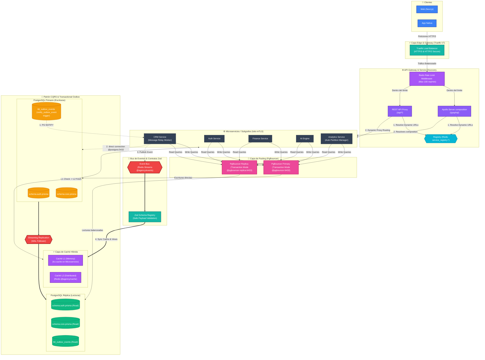

# Plataforma - Arquitectura Empresarial V7 (Ultimate Scale, Read Replicas & Hybrid Caching)

Este diagrama representa el estado actual de la plataforma (V7), incorporando **Replicación de Lectura de PostgreSQL**, **Caché Híbrida L1/L2**, **Procesamiento de Outbox en tiempo real (LISTEN/NOTIFY)**, **Limitación de Tasa (Rate Limiting) respaldada por Redis**, **Soporte HTTP/3 (QUIC)** y **Particionado Automático de Logs**.

## Características Nivel V7 Implementadas

1. **División de Lectura/Escritura (Read-Write Splitting):** Despliegue de una réplica de base de datos (`postgres-replica`) y un pool de lectura dedicado (`pgbouncer-replica` en el puerto `6433`). Los queries de lectura (`findMany`, `findUnique`) se enrutan de forma segura a la réplica WAL follower, reduciendo drásticamente la carga de CPU y memoria en el primario.
2. **Procesamiento de Outbox Asíncrono por Eventos (LISTEN/NOTIFY):** Un trigger PostgreSQL en `tbl_outbox_events` emite notificaciones asíncronas inmediatas. El `Message Relay Worker` de `crm-service` se conecta directamente por sockets a PostgreSQL para escuchar (`LISTEN`), eliminando por completo el polling a base de datos y logrando una latencia de sincronización de eventos inferior a 100ms.
3. **Capa de Caché Híbrida L1/L2:** Helper `@agency/database` que expone una caché local L1 en memoria (mediante `lru-cache` para velocidad sub-milisegundo en llamadas calientes) y una caché distribuida L2 en red (mediante `Redis` para consistencia multiservicio). Soporta carga perezosa (lazy-loading) para máxima resiliencia en el arranque de microservicios.
4. **Soporte de Protocolo HTTP/3 (QUIC):** Configuración de Traefik exponiendo puertos UDP en el puerto `8443` para dar soporte nativo al protocolo de última generación HTTP/3, optimizando la latencia de red para clientes móviles o conexiones inestables.
5. **Mantenimiento y Particionamiento Automático de Tablas:** Rutina automatizada diaria en `analytics-service` que crea de forma proactiva particiones nativas por fecha en las tablas de logs (`tbl_user_activity_logs` y `tbl_usage_logs`), optimizando el rendimiento de los índices.
6. **Límite de Tasa en Gateway (Rate Limiting):** Middleware en el `api-gateway` respaldado por Redis para proteger los endpoints públicos contra ataques de denegación de servicio (DoS), limitando las llamadas concurrentes a un máximo de 100 peticiones por minuto por IP.
7. **Monitoreo de Queries con `pg_stat_statements`:** Habilitación del módulo de estadísticas de consulta nativo en PostgreSQL para auditoría detallada de tiempos de ejecución de queries y consumo de recursos.