# Plataforma - Arquitectura Empresarial V2 (Alta Eficiencia)

Este diagrama representa el estado arquitectónico final (V2) de la plataforma, el cual incluye **Bases de Datos Segregadas**, un **Bus de Eventos (Event-Driven Architecture)**, **Service Mesh (mTLS)** y **Edge Cache**.

```mermaid
graph TD
    %% Estilos
    classDef client fill:#3b82f6,stroke:#1e40af,color:white,stroke-width:2px;
    classDef gateway fill:#10b981,stroke:#047857,color:white,stroke-width:2px;
    classDef core fill:#8b5cf6,stroke:#5b21b6,color:white;
    classDef ai fill:#ec4899,stroke:#be185d,color:white;
    classDef data fill:#f59e0b,stroke:#b45309,color:white;
    classDef eventbus fill:#ef4444,stroke:#991b1b,color:white,stroke-width:3px;

    %% Clientes y Frontend
    subgraph Clients ["🚀 Clientes e Interfaces"]
        WEB["Frontend (Next.js)"]:::client
        APP["App Móvil / PWA"]:::client
        EXT["Integraciones Externas"]:::client
    end

    %% Capa Edge
    subgraph Edge ["🌍 Capa de Entrada (Edge)"]
        GW["🛡️ API Gateway (:8080) <br/> Ruteo, Rate Limiting"]:::gateway
        EDGE_CACHE[("⚡ Edge Cache <br/> (Redis)")]:::data
        GW --- EDGE_CACHE
    end

    %% Service Mesh
    subgraph ServiceMesh ["🕸️ Service Mesh (Istio / Linkerd) - Comunicación Interna con mTLS"]
        
        %% Core Services
        subgraph Core ["Núcleo de Negocio"]
            AUTH["🔐 Auth Service"]:::core
            CRM["📊 CRM Service"]:::core
            FIN["💳 Finance Service"]:::core
            ADMIN["🛠️ Admin Service"]:::core
            CAL["📅 Calendar Service"]:::core
        end

        %% Workflow & Comms
        subgraph Comms ["Comunicaciones & Flujos"]
            AUTO["⚡ Automation Service"]:::core
            INBOX["📨 Inbox Service"]:::core
            INT["🔗 Integration Service"]:::core
            PUB["🌍 Public API Service"]:::core
        end

        %% AI & Media
        subgraph AIMedia ["Inteligencia & Contenido"]
            AIE["🧠 AI Engine"]:::ai
            AGENTS["🤝 Agent Team Engine"]:::ai
            VID["🎬 Video Service"]:::ai
            DOC["📄 Document Service"]:::ai
            MKT["📢 Marketing Service"]:::ai
        end

        %% Analytics
        subgraph Observability ["Observabilidad"]
            ANLY["📈 Analytics Service"]:::core
        end

        %% Central Event Bus
        BUS{{"🚀 Event Bus Central <br/> (Redis Streams @agency/events)"}}:::eventbus
    end

    %% Infraestructura de Datos Segregada
    subgraph Infrastructure ["💾 Almacenamiento Segregado (Database-per-Domain)"]
        DB_AUTH[("PostgreSQL <br/> (schema.auth.prisma)")]:::data
        DB_BIZ[("PostgreSQL <br/> (schema.core.prisma)")]:::data
        DB_MEDIA[("PostgreSQL <br/> (schema.media.prisma)")]:::data
        DB_ANLY[("PostgreSQL / ClickHouse <br/> (schema.analytics.prisma)")]:::data
    end

    %% Relaciones Externas a Gateway
    WEB --> |REST/WS| GW
    APP --> |REST/WS| GW
    EXT --> |API| GW

    %% Gateway a Servicios (Llamadas Síncronas)
    GW --> |Peticiones HTTP| Core
    GW --> |Peticiones HTTP| Comms
    GW --> |Peticiones HTTP| AIMedia
    GW --> |Peticiones HTTP| Observability

    %% Comunicación Asíncrona (Event Bus)
    Core <==> |Publica/Escucha Eventos| BUS
    Comms <==> |Publica/Escucha Eventos| BUS
    AIMedia <==> |Publica/Escucha Eventos| BUS
    Observability <==> |Publica/Escucha Eventos| BUS

    %% Conexiones a BD Segregadas
    AUTH --> DB_AUTH
    
    CRM --> DB_BIZ
    FIN --> DB_BIZ
    ADMIN --> DB_BIZ
    CAL --> DB_BIZ
    AUTO --> DB_BIZ

    VID --> DB_MEDIA
    DOC --> DB_MEDIA
    MKT --> DB_MEDIA
    AIE --> DB_MEDIA
    AGENTS --> DB_MEDIA

    ANLY --> DB_ANLY
    INT --> DB_ANLY
    INBOX --> DB_ANLY
```

## Puertos de Servicios y Nodos

| Servicio | Puerto | Base de Datos |
|----------|--------|---------------|
| API Gateway | 8080 | N/A (Usa Redis Edge Cache) |
| Auth Service | 4001 | schema.auth.prisma |
| CRM Service | 4002 | schema.core.prisma |
| Automation | 4003 | schema.core.prisma |
| AI Engine | 4004 | schema.media.prisma |
| Inbox | 4005 | schema.analytics.prisma |
| Finance | 4006 | schema.core.prisma |
| Video | 4007 | schema.media.prisma |
| Calendar | 4008 | schema.core.prisma |
| Marketing | 4009 | schema.media.prisma |
| Integration | 4010 | schema.analytics.prisma |
| Document | 4011 | schema.media.prisma |
| Agent Team | 4012 | schema.media.prisma |
| Analytics | 4013 | schema.analytics.prisma |
| Admin | 4014 | schema.core.prisma |
| Public API | 4015 | N/A (Pasa por Event Bus) |

## ¿Por qué es esta arquitectura más eficiente?
1. **Edge Cache:** El Gateway intercepta datos estáticos para no cargar a los microservicios.
2. **Event Bus (`@agency/events`):** En lugar de que el CRM espere a que Finanzas responda (bloqueando el hilo), el CRM publica un evento y Finanzas lo procesa cuando puede. Máxima resiliencia.
3. **Database Segregation:** 4 esquemas de Prisma independientes. Las bases de datos no compiten por recursos de CPU.
4. **Service Mesh:** Istio inyectado a nivel de Kubernetes gestiona balanceo de carga interno y seguridad mTLS entre los servicios.